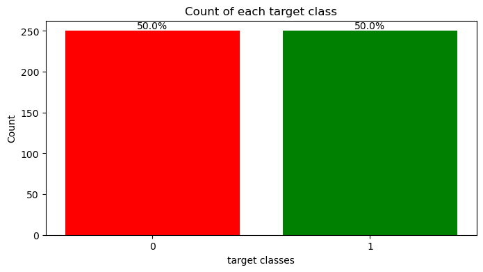
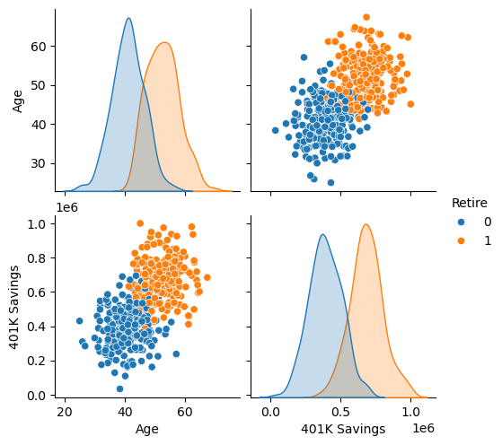
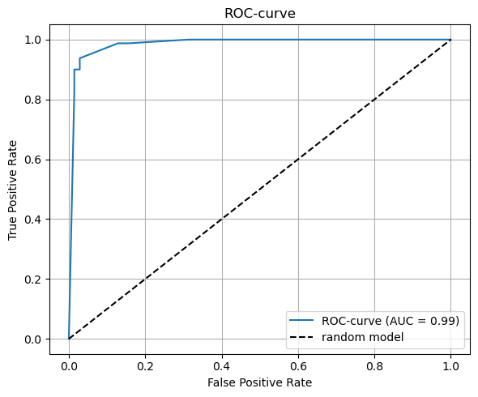
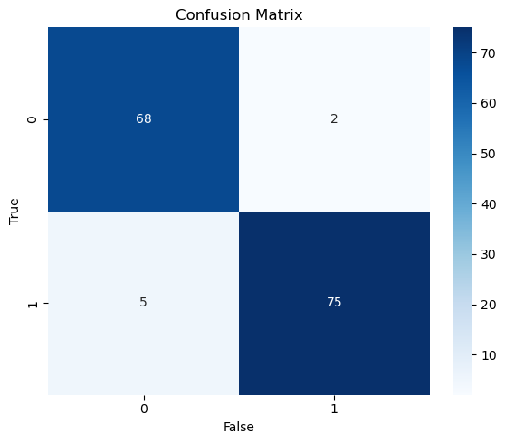

# 🏦 Bank Customer Retirement Prediction

## Project Overview

This project aims to predict whether a bank customer will retire (leave the bank's services) based on demographic and financial information.

The project covers the complete machine learning workflow, including exploratory data analysis, missing value treatment, feature engineering, preprocessing evaluation, model comparison, and final model selection.

---

## Objective

Build a binary classification model capable of predicting whether a customer will:

* **0** → Remain an active customer
* **1** → Retire / Leave the bank

---

## Dataset

### Features

| Feature      | Description                |
| ------------ | -------------------------- |
| Age          | Customer age               |
| 401K Savings | Retirement account savings |

**Customer ID** was removed because it acts only as an identifier and contains no predictive information.

### Dataset Characteristics

* Binary classification problem
* Balanced target classes
* Numerical variables only
* No categorical features
* Missing values present

---

## Exploratory Data Analysis



* Retirement probability increases significantly with age.
* Customers aged 55+ are predominantly retired.
* Customers with higher retirement savings are more likely to retire.
* A positive relationship exists between **Age** and **401K Savings**.
* Feature distributions are approximately normal.

---

## Feature Engineering

A new feature was created:

```python
SavingsPerAge = 401K_Savings / Age
```

This feature improved model performance by capturing retirement savings relative to customer age.

### Conclusions

* Mean Imputation achieved the best overall results.
* Scaling and transformation techniques did not improve model performance.
* The engineered feature **SavingsPerAge** improved predictive power.

---

## Models Evaluated

* Logistic Regression
* Decision Tree
* Random Forest
* K-Nearest Neighbors (KNN)
* Support Vector Classifier (SVC)

---

## Evaluation Metrics

The following metrics were used:

* Accuracy
* F1 Score
* ROC-AUC
* Confusion Matrix
* Prediction Time

---

## Results

| Model               | Accuracy | F1 Score | ROC-AUC |
| ------------------- | -------- | -------- | ------- |
| Decision Tree       | 95.4%    | 95.2%    | 99.2%   |
| Random Forest       | 95.4%    | 95.2%    | 99.0%   |
| KNN                 | 94.6%    | 94.4%    | 99.2%   |
| Logistic Regression | 94.0%    | 93.9%    | 98.6%   |
| SVC                 | 94.0%    | 94.2%    | 98.7%   |


---

## Final Model

### Decision Tree

Decision Tree was selected as the final model because it provides:

* Highest Accuracy
* Highest F1 Score
* Excellent ROC-AUC
* No significant overfitting
* Fastest prediction time (~0.001 sec)




---

## Conclusion

All evaluated models achieved strong predictive performance and demonstrated excellent generalization ability.

The engineered feature **SavingsPerAge** positively affected several models and improved predictive performance. Advanced preprocessing techniques such as scaling, transformations, and complex imputation methods did not provide significant benefits compared to simpler approaches.

Despite the limited number of available predictors, the models achieved excellent results, with a maximum test accuracy of approximately **95.4%**.

Among all evaluated algorithms, **Decision Tree** delivered the best balance of predictive performance, interpretability, and computational efficiency, making it the preferred model for this dataset.
